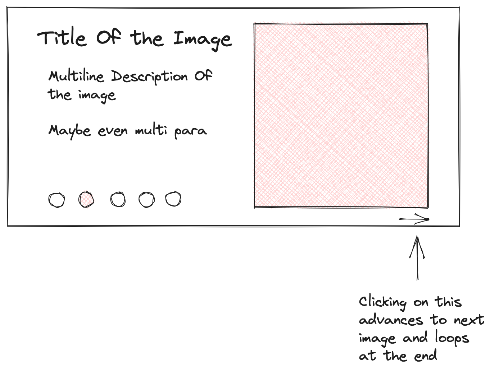

# `fastn` Frontend Workshop: Build An Image Gallery (Section)

01-hello-world (let's teach some attributes here, color, padding)
02-basic-text-properties (role: $inherited, manual?)
03-decorative properties (border, background, padding, margin)
03-image (image properties)
03-containers(row, column, spacing)
- document variables
- records (defining, and using)
- lists, loops
- inheritance
- regular component
- mutable variables and *operator
- event handling (user defined functions)
- category stuff
- documentation page (as arpita created)
- using it in your acme site
