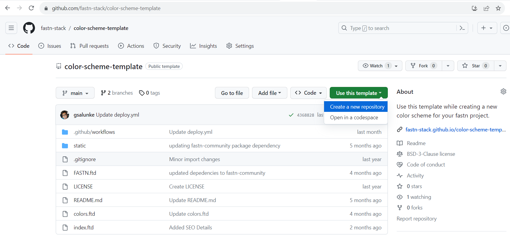
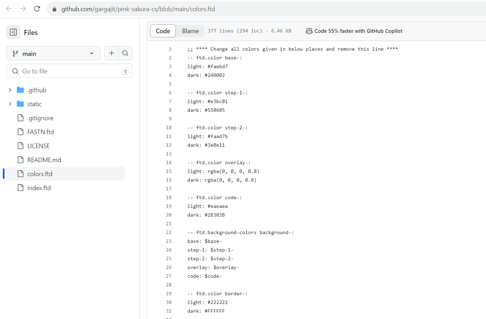
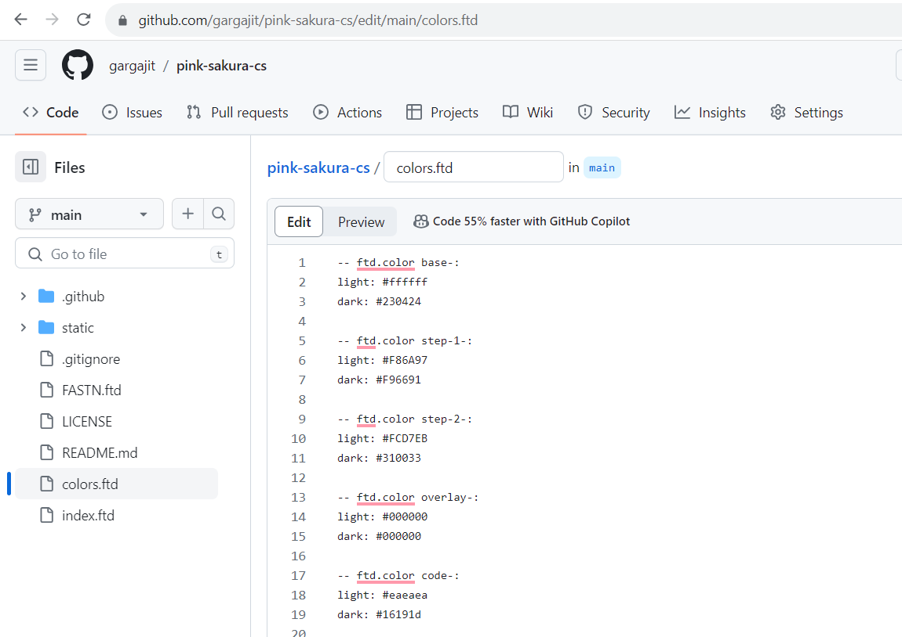

# Create a color scheme

- Use the [color-scheme-template](https://github.com/fastn-stack/color-scheme-template) to create the repository.

- Open the `colors.ftd` file.

- Edit the `colors.ftd` file and change all the colors. 

- Commit the changes.

- Open `index.ftd` file.

- Edit the file and replace all instances of `$ftd.default-colors` with `$main`.

- Commit the changes.

- The color scheme is ready.

- You can move to [create font](/c-design/02-create-font.md)
