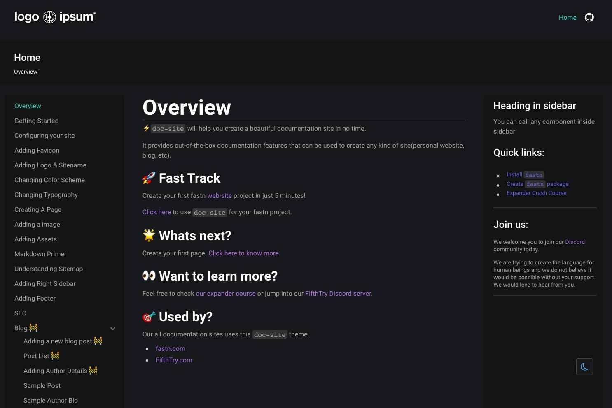

# fastn Track - Profile Card Component

## Welcome! 👋

Thanks for checking out this fastn coding challenge.

*To do this challenge, you need a basic understanding of fastn framework.*

## The challenge

Your challenge is to build out this FAQ accordion card and get it looking as close to the design as possible.

You will have to use fastn to complete the challenge. So if you've got something you'd like to practice, feel free to give it a go.

Your users should be able to:

- View the optimal layout for the component depending on their device's screen size
- See hover states for all interactive elements on the page
- Hide/Show the answer to a question when the question is clicked

Want some support on the challenge? [Join our community](https://fastn.com/discord) and ask questions in the *#ask-for-help* channel.

## Where to find everything

Your task is to build out the project to the designs inside the `/design` folder. You will find both a mobile and a desktop version of the design. 

The designs are in JPG static format. Using JPGs will mean that you'll need to use your best judgment for styles such as `font-size`, `padding` and `margin`. 

You will find all the required assets in the `/images` folder. The assets are already optimized.

There is also a `style-guide.md` file containing the information you'll need, such as color palette and fonts.

## Building your project

Feel free to use any workflow that you feel comfortable with. Below is a suggested process, but do not feel like you need to follow these steps:

1. Initialize your project as a public repository on [GitHub](https://github.com/). Creating a repo will make it easier to share your code with the community if you need help. If you're not sure how to do this, [have a read-through of this Try Git resource](https://try.github.io/).
2. Configure your repository to publish your code to a web address. This will also be useful if you need some help during a challenge as you can share the URL for your project with your repo URL. There are a number of ways to do this, and we provide some recommendations below.
3. Look through the designs to start planning out how you'll tackle the project. This step is crucial to help you think ahead for classes to create reusable styles.
4. Before adding any styles, structure your content with fastn. Writing your structure first can help focus your attention on creating well-structured content.
5. Write out the base styles for your project, including general content styles.
6. Start adding styles to the top of the page and work down. Only move on to the next section once you're happy you've completed the area you're working on.

## Deploying your project

As mentioned above, there are many ways to host your project for free. Recommended hosts are:

- [GitHub Pages](https://pages.github.com/)
- [Vercel](https://vercel.com/)
- [Netlify](https://www.netlify.com/)

## Sharing your solution

There are multiple places you can share your solution:

1. Share your solution page in the `#innerve-soc channel` of the [community](https://fastn.com/discord). 
2. Tweet [@fastn_stack](https://twitter.com/fastn_stack) and mention *@fastn_stack*, including the repo and live URLs in the tweet. We'd love to take a look at what you've built and help share it around.
3. Share your solution on other social channels like LinkedIn.
4. Blog about your experience building your project. Writing about your workflow, technical choices, and talking through your code is a brilliant way to reinforce what you've learned. Great platforms to write on are [dev.to](https://dev.to/), [Hashnode](https://hashnode.com/), and [CodeNewbie](https://community.codenewbie.org/).

We provide templates to help you share your solution once you've submitted it on the platform. Please do edit them and include specific questions when you're looking for feedback. 

The more specific you are with your questions the more likely it is that another member of the community will give you feedback.

## Got feedback for us?

We love receiving feedback! We're always looking to improve our challenges and our platform. So if you have anything you'd like to mention, please join our [community](https://fastn.com/discord) and let us know.

This challenge is completely free. Please share it with anyone who will find it useful for practice.

*Have fun building!* 🚀

# Overview

[doc-site](https://fastn-community.github.io/doc-site/) will help you create
a beautiful documentation site in no time.

It provides out-of-the-box documentation features that can be used to create any
kind of site(personal website, blog, etc).

# Preview

## Get Rolling

[Click here](https://fastn-community.github.io/doc-site/) to learn how to use this template.

# [Dive into the Docs](https://fastn-community.github.io/doc-site/)

# See it in Action!

Explore websites and projects that have utilized this component/template 
**[here](https://fastn-community.github.io/doc-site/#dart-used-by)** for
inspiration.

## fastn and Curious?

Discover more of fastn here.

- [Expander Crash Course](https://fastn.com/expander/)
- [Video Tutorials](https://fastn.com/expander/hello-world/-/build/)
- [Explore more Templates/ Components/ Package](https://fastn.com/featured/)

## Become a fastn Contributor

1.  Finish the [Expander Crash Course](https://fastn.com/expander/)
2.  Share your progress and ideas on [Discord](https://discord.gg/bucrdvptYd).
3.  Let our team guide you on your contributor journey.

## Become a fastn-trailblazer

- [Join our Discord Server](https://discord.gg/bucrdvptYd) to connect with other fastn enthusiasts and stay up to date with the latest developments.
- [Star us on GitHub](https://github.com/fastn-stack/fastn/)
